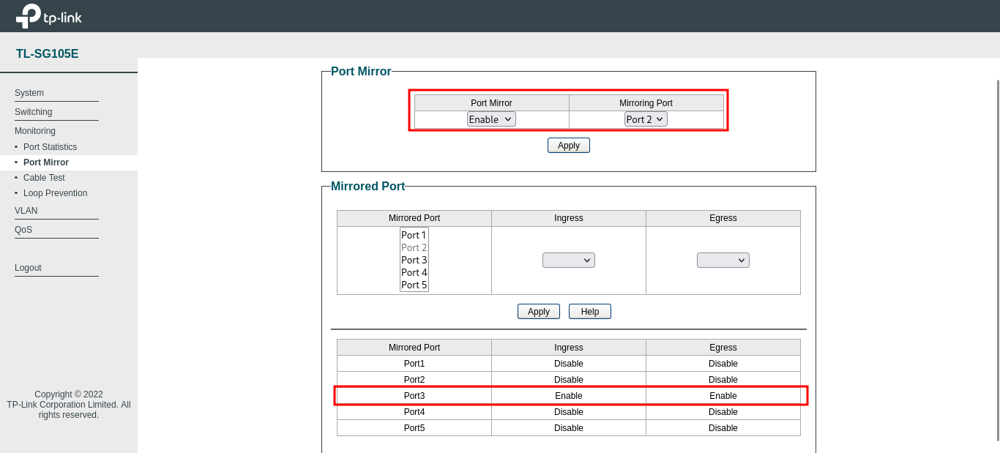

# Network Traffic Analysis Without Administrative Access: A Comprehensive Guide

## Introduction
As a pentester, you encounter various challenges during different types of assessments. Most of the time, you work remotely, but sometimes you need to conduct on-site assessments that require analyzing client-server communication of specific software applications. A common obstacle is that customers are not really eager to grant administrative rights on the hosts where target applications are installed, preventing you from installing essential tools like Wireshark to perform network traffic analysis. In some cases it is even not possible because of the internal policies, so you need to think creatively about how to bypass such restrictions and perform a penetration test to the full extent required by your contract.

In this blog article, we explore three practical methods for conducting network sniffing even when you don't have administrative control over the target host, enabling you to fulfill your testing objectives without compromising security policies. 

## The Challenge
When faced with restricted access scenarios, you might consider these problematic approaches: 
1. Pressuring the system administrator for administrative rights: Just kidding. Simply don't do it. This approach can damage client relationships and is unprofessional. 
2. Escalating privileges through vulnerability exploitation: While privilege escalation is part of penetration testing, modern systems have significantly reduced attack surfaces (the days when SeImpersonate privilege was granted to almost any account are long gone).

Fortunately, there are legitimate alternatives that don't require administrative access on the target system.

### Solution 1: Bridged Network Interfaces
#### Required Equipment
* **USB Ethernet adapters**: Portable network interfaces for your laptop (at least one should be already provided on your laptop, otherwise two adapters).
* **Ethernet cables**: Usually available on-site, but just in case
#### Network Setup Architecture
The concept involves transforming your pentesting laptop into a network bridge that intercepts all traffic from the client. 

```
        USB Ethernet 1 (eth1) -> Ethernet cable -> Switch/Router
        /
Pentester PC (Wireshark)
        \
        USB Ethernet 2 (eth2) -> Ethernet cable -> Client 
```
*Bridged interface network topology: the pentesting laptop with two USB Ethernet adapters connected to it. One is connected to the switch or router, the other one - to the client.*
#### Installation and Configuration

First, install the bridge utilities package (not provided by default on Kali Linux):
```
sudo apt-get install bridge-utils
```
*Code Snippet 1: Installing bridge utilities package*

Next, configure the bridged interface with the following commands:
```
# Take down both network interfaces
ifconfig eth1 down
ifconfig eth2 down

# Create a new bridge interface
brctl addbr br0

# Add both ethernet interfaces to the bridge
brctl addif br0 eth1
brctl addif br0 eth2

# Bring up all interfaces
ifconfig eth1 up
ifconfig eth2 up
ifconfig br0 up 

# Obtain IP address via DHCP
dhclient br0
```
*Code Snippet 2: Bridge interface configuration commands*

Once configured, your bridge interface will automatically obtain an IP address, and the client's Ethernet interface will establish connectivity through your laptop. At this point, launch Wireshark and monitor the **br0** interface to capture all traffic flowing between the client and the network. 

#### Solution 2: Wireless Access Point (Hotspot)
##### Use Case
This method is ideal when the target device lacks Ethernet connectivity and relies solely on wireless connection. 
##### Prerequisites
* **Main network interface**: for internet connectivity (assumed as eth1)
* **Wireless interface**: for creating the access point (assumed as wlan0)

##### Configuration Steps
1. Wireless Interface Setup
Assign a unique IP to your wireless adapter
```
sudo ip addr add 10.0.0.1/24 dev wlan0
```
*Code Snippet 3: Configuring wireless adapter IP address*

2. DHCP Service Configuration
Edit the dnsmasq configuration file (/etc/dnsmasq.conf):
```
domain-needed
bogus-priv
no-resolv
filterwin2k
expand-hosts
domain=localdomain
local=/localdomain/
listen-address=10.0.0.1
dhcp-range=10.0.0.100,10.0.0.199,12h
dhcp-lease-max=100
dcp-option=option:router,10.0.0.1
dhcp-authoritative
server=8.8.8.8
server=8.8.4.4
```
*Code Snippet 4: dnsmasq configuration for DHCP services*

Start the DHCP server:
```
sudo dnsmasq -C /etc/dnsmasq.conf
```
*Code Snippet 5: Starting the DHCP server*

3. Access Point Configuration 
Create the hostapd configuration file:
```
touch /etc/hostapd/hostapd.conf
```
Configure the access point parameters:
```
interface=wlan0
ssid=MYAP
channel=11
hw_mode=g
ieee80211n=1
wpa=2
wpa_key_mgmt=WPA-PSK
rsn_pairwise=CCMP
wpa_passphrase=MyS3CuR3Passw0rd!
```
*Code Snippet 6: hostapd configuration for wireless access point*
Launch the access point:
```
sudo hostapd hostapd.conf
```
4. Network Forwarding and NAT Configuration
Enable IP forwarding: 
```
sudo echo 1 > /proc/sys/net/ipv4/ip_forward
```
*Code Snippet 8: Enabling IP forwarding*

Configure NAT using iptables:
```
sudo iptables -t nat -A POSTROUTING -o eth1 -s 10.0.0.0/24 -j MASQUERADE
```
*Code Snippet 9: Configuring NAT for internet access*
5. Additional Forwarding Rules
In some cases, you may need explicit forwarding rules:
```
iptables -A FORWARD -i wlan0 -o eth1 -s 10.0.0.0/24 -j ACCEPT
iptables -A FORWARD -i eth1 -o wlan0 -d 10.0.0.0/24 -j ACCEPT
```
*Code Snippet 10: Additional forwarding rules for traffic routing*
Verify your configuration:
```
sudo iptables -L 
sudo iptables -t nat -L
```
*Code Snippet 11: Verifying NAT configuration*
After completing the setup, test the access point by connecting a device and verifying internet connectivity. Once confirmed, start Wireshark on the **wlan0** interface to capture client traffic. 

#### Solution 3: Managed Switch Port Mirroring
##### Prerequisites
This method requires cooperating with the system administrator as they should adjust a configuration on the **managed** network switch that supports port mirroring functionality.

##### Configuration Scheme
```
                 / -> port 2 (mirroring port) -> Pentest laptop
router -> switch 
                 \ -> port 3 (mirrored port) -> Client to be analyzed
```
*Port mirroring setup: Traffic from the client port is mirrored to the monitoring port*

##### Configuration Process
Request the system administrator to configure port mirroring on an available switch port, whereby the target client is connected on the source/mirrored port, and your pentesting laptop is connected on the destination/mirroring port. 
##### Switch Configuration Example
The following example demonstrates configuration on a TP-Link TL-SG105E managed switch:


*TP-LINK Web Interface: port mirroring configuration showing the setup for duplicating traffic from port 3 (client) to port 2 (pentester laptop)*

Once the switch configuration is active, launch Wireshark. You will capture all traffic flowing through the mirrored port. 

## Conclusion
These three methods provide practical solutions for conducting network traffic analysis during penetration tests when administrative access is restricted. Each approach offers distinct advantages: 
* **Bridged interfaces**: Ideal for wired connections
* **Wireless access point**: Perfect for WiFi-only devices
* **Port mirroring**: Requires managed switch being used in the tested environment, but provides a very transparent monitoring solution. 

Remember to always coordinate with system administrators and document your testing methodology to ensure transparency and maintain trust throughout the engagement.
